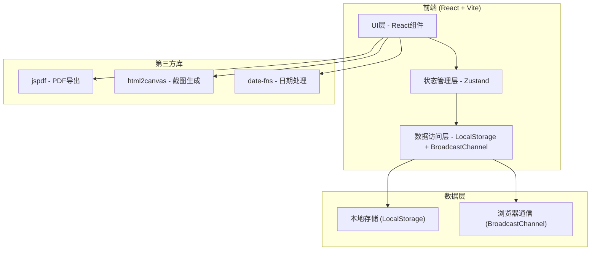

# 家庭菜单计划与购物清单生成工具 - 技术架构文档

## 1. 架构设计



## 2. 技术描述

- **前端框架**：React@18 + TypeScript
- **构建工具**：Vite@5
- **样式方案**：TailwindCSS@3 + CSS变量
- **状态管理**：Zustand（轻量级状态管理，支持中间件持久化）
- **路由**：React Router DOM@6
- **日期处理**：date-fns（轻量级日期库）
- **PDF导出**：jspdf + html2canvas
- **多人协作**：BroadcastChannel API（浏览器标签页间同步，模拟多人协作）
- **数据持久化**：LocalStorage（用户数据本地存储）
- **图标**：Lucide React（线性图标库）

## 3. 目录结构

```
src/
├── components/          # 通用组件
│   ├── Layout/         # 布局组件
│   ├── MealCard/       # 餐次卡片
│   ├── IngredientItem/ # 食材项
│   ├── Modal/          # 弹窗组件
│   └── Button/         # 按钮组件
├── pages/              # 页面组件
│   ├── MealPlan/       # 菜单计划页
│   ├── ShoppingList/   # 购物清单页
│   ├── Templates/      # 模板管理页
│   ├── Export/         # 导出打印页
│   └── Collaboration/  # 家庭协作页
├── store/              # 状态管理
│   ├── useMealStore.ts    # 菜单状态
│   ├── useIngredientStore.ts # 食材状态
│   ├── useTemplateStore.ts # 模板状态
│   └── useCollabStore.ts   # 协作状态
├── types/              # TypeScript类型定义
│   └── index.ts
├── utils/              # 工具函数
│   ├── date.ts         # 日期工具
│   ├── ingredient.ts   # 食材计算
│   ├── pdf.ts          # PDF生成
│   └── storage.ts      # 存储工具
├── data/               # 静态数据
│   ├── dishes.ts       # 预置菜品库
│   └── ingredients.ts  # 食材分类数据
├── hooks/              # 自定义Hooks
│   ├── useCollaboration.ts # 协作Hook
│   └── useMealCalculation.ts # 食材计算Hook
├── App.tsx
├── main.tsx
└── index.css
```

## 4. 路由定义

| 路由 | 页面 | 说明 |
|------|------|------|
| / | 菜单计划页 | 默认首页，展示周菜单 |
| /shopping-list | 购物清单页 | 食材分类清单 |
| /templates | 模板管理页 | 菜单模板管理 |
| /export | 导出打印页 | PDF导出和打印预览 |
| /collaboration | 家庭协作页 | 成员管理和协作设置 |

## 5. 数据模型

### 5.1 数据模型定义

```mermaid
erDiagram
    MEAL_PLAN {
        string weekKey PK "周标识 YYYY-WW"
        DayMeal[] days "7天的餐食数据"
    }
    DAY_MEAL {
        string date PK "日期 YYYY-MM-DD"
        Dish[] breakfast "早餐菜品"
        Dish[] lunch "午餐菜品"
        Dish[] dinner "晚餐菜品"
    }
    DISH {
        string id PK "菜品ID"
        string name "菜品名称"
        string category "菜品分类"
        Ingredient[] ingredients "所需食材"
        int servings "份量(人份)"
        string emoji "图标emoji"
    }
    INGREDIENT {
        string id PK "食材ID"
        string name "食材名称"
        string category "分类"
        float amount "用量"
        string unit "单位"
    }
    TEMPLATE {
        string id PK "模板ID"
        string name "模板名称"
        string description "描述"
        string category "分类标签"
        DayMeal[] meals "7天餐食数据"
        string coverEmoji "封面emoji"
        number createdAt "创建时间"
    }
    SHOPPING_ITEM {
        string ingredientId FK "食材ID"
        string name "食材名称"
        string category "分类"
        float totalAmount "总用量"
        string unit "单位"
        boolean checked "是否已有/已购"
        boolean adjusted "是否手动调整过"
    }
    FAMILY_MEMBER {
        string id PK "成员ID"
        string name "成员名称"
        string avatar "头像emoji"
        string color "标识颜色"
        boolean isAdmin "是否管理员"
        boolean isOnline "在线状态"
        string lastActive "最后活跃时间"
    }
```



### 5.2 TypeScript类型定义

```typescript
// 食材
interface Ingredient {
  id: string;
  name: string;
  category: IngredientCategory;
  amount: number;
  unit: string;
}

type IngredientCategory = 
  | 'vegetable' 
  | 'meat' 
  | 'seasoning' 
  | 'staple' 
  | 'fruit' 
  | 'dairy' 
  | 'seafood' 
  | 'other';

// 菜品
interface Dish {
  id: string;
  name: string;
  category: string;
  ingredients: Ingredient[];
  servings: number;
  emoji: string;
}

// 一天的餐食
interface DayMeals {
  breakfast: Dish[];
  lunch: Dish[];
  dinner: Dish[];
}

// 周菜单
interface MealPlan {
  weekKey: string;
  days: Record<string, DayMeals>; // key: YYYY-MM-DD
}

// 购物清单项
interface ShoppingItem {
  ingredientId: string;
  name: string;
  category: IngredientCategory;
  totalAmount: number;
  unit: string;
  checked: boolean;
  adjusted: boolean;
}

// 模板
interface MealTemplate {
  id: string;
  name: string;
  description: string;
  category: string;
  meals: Record<string, DayMeals>;
  coverEmoji: string;
  createdAt: number;
}

// 家庭成员
interface FamilyMember {
  id: string;
  name: string;
  avatar: string;
  color: string;
  isAdmin: boolean;
  isOnline: boolean;
  lastActive: number;
}
```

## 6. 协作同步机制

使用 BroadcastChannel API 实现浏览器标签页间的实时数据同步，模拟多人协作场景：

1. **通道创建**：每个标签页创建同名 BroadcastChannel
2. **消息广播**：数据变更时广播变更消息
3. **消息接收**：接收到消息后更新本地状态
4. **冲突处理**：以最后修改为准，本地状态合并
5. **在线状态**：通过心跳消息维护在线成员列表

## 7. 核心算法

### 7.1 食材汇总算法

- 遍历一周所有菜品的所有食材
- 按食材ID分组，累加用量
- 统一单位（如克、千克转换）
- 按分类排序输出

### 7.2 周日期计算

- 使用 date-fns 计算当前周的起止日期
- 支持上一周/下一周切换
- weekKey 格式：`YYYY-WW`（ISO周）

## 8. 性能与体验优化

- 状态持久化：使用 Zustand persist 中间件，自动同步到 LocalStorage
- 按需渲染：食材列表使用虚拟滚动（数据量大时）
- 防抖优化：输入框搜索防抖处理
- 离线可用：纯前端架构，无网络依赖
- 动画流畅：使用 CSS transform 和 opacity 实现高性能动画
